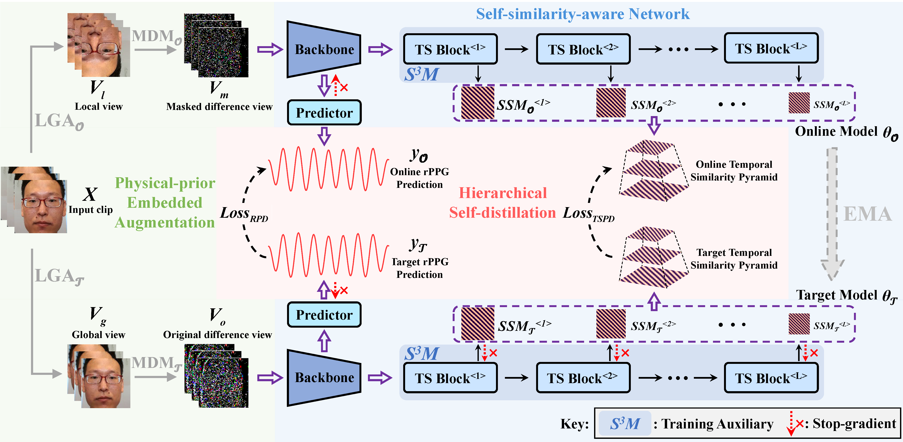
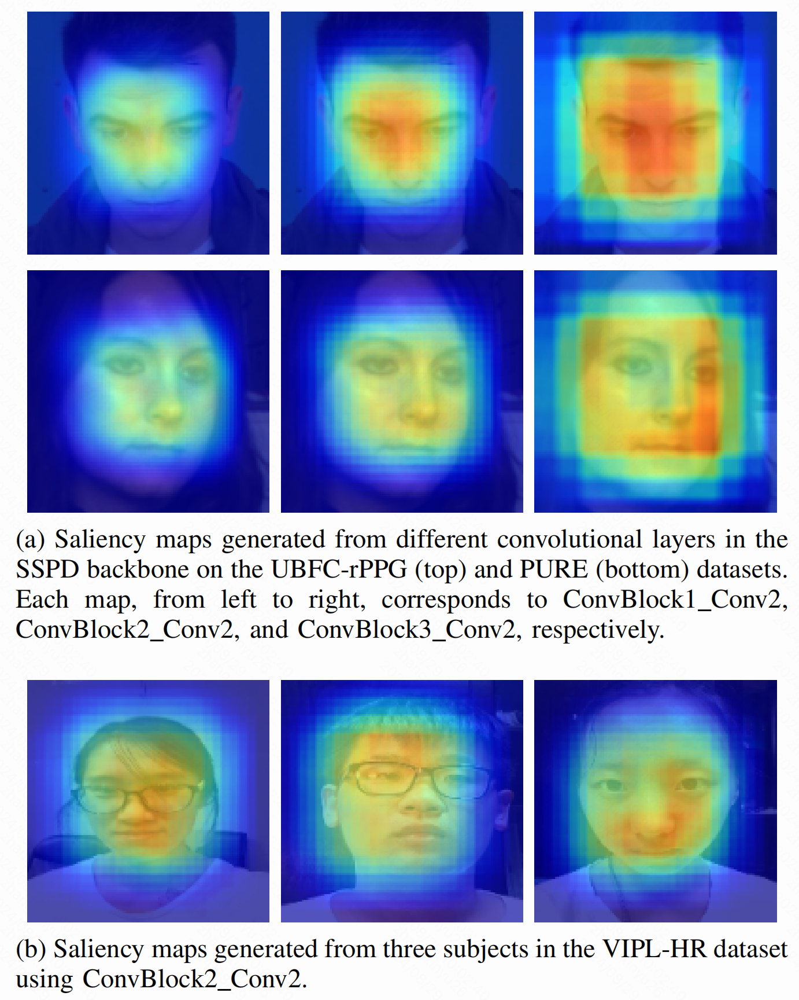

# Self-similarity Prior Distillation for Unsupervised Remote Physiological Measurement
PyTorch implementation for [**SSPD**](https://ieeexplore.ieee.org/document/10542453).

<div align="center">
  
</div>

## Preparation
1. Requirements.
    ```bash
    Requirements:           
    torch==1.7.0+cu110
    torchvision==0.8.0+cu110
    numpy==1.21.6           
    pycwt==0.3.0a22
    opencv-python==4.5.5.62  
    scipy==1.7.3
    einops==0.6.1
    dlib==19.24.6
    tqdm==4.66.4
    scikit-learn==1.0.2
    matplotlib==3.5.3
    albumentations==1.3.1
    Pillow==9.5.0
    ```

2. Preprocessing.
    ```bash
    python -u UBFC_preprocess.py
      --data-path /path/to/ubfc/
      --infos-path /path/to/ubfc-infos/
      --frame-path /path/to/save/frame_list
      --face-data-path /path/to/save/face_data
      --face-img-path /path/to/save/face_img
    ```

   The preprocessed UBFC-HR dataset will be as follows:
   ```
   ├── ubfc-frame-SKD                      
   │   └── frame_list
   └── ubfc-face-SKD            
       ├── data
       └── img
   ```

   For each file in `frame_list`:
   ```
   └── frame_list                     
       ├── 0_p1_0_1546_103.46759495194506_.npy
       ├── 1_p10_0_2023_110.43315385913316_.npy
       ├── ......
       └── 41_p9_0_2015_106.97732722299932_.npy
   ```

## Training
Default hyperparameter settings based on single GPU card "NVIDIA GeForce RTX 3090".
```bash
python -u train.py 
 --frame-path /path/to/frame_list 
 --SSL_length 300
 --GPU-id 0
 --batch-size 12
 --epochs 30
 --log-enable True
```

## Evaluation
Test with your own data:
```bash
python -u test.py
 --frame-path /path/to/frame_list
 --GPU-id 0
 --pretrained ./pretrained/ubfc.pth
 --visual-enable True
```

## Visualization
Based on [LayerCAM](https://github.com/PengtaoJiang/LayerCAM-jittor).

<div align="center">
  
</div>


## Citation
```
@ARTICLE{SSPD,
  author={Zhang, Xinyu and Sun, Weiyu and Lu, Hao and Chen, Ying and Ge, Yun and Huang, Xiaolin and Yuan, Jie and Chen, Yingcong},
  journal={IEEE Transactions on Multimedia}, 
  title={Self-Similarity Prior Distillation for Unsupervised Remote Physiological Measurement}, 
  year={2024},
  volume={26},
  number={},
  pages={10290-10305},
  keywords={Physiology;Computational modeling;Noise;Task analysis;Heart beat;Estimation;Photoplethysmography;Remote photoplethysmography (rPPG);multimedia applications;self-similarity;unsupervised learning;self-distillation},
  doi={10.1109/TMM.2024.3405720}}
```